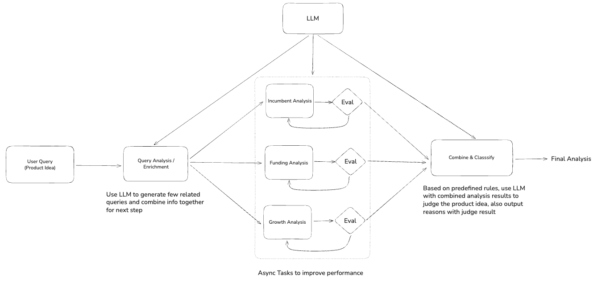
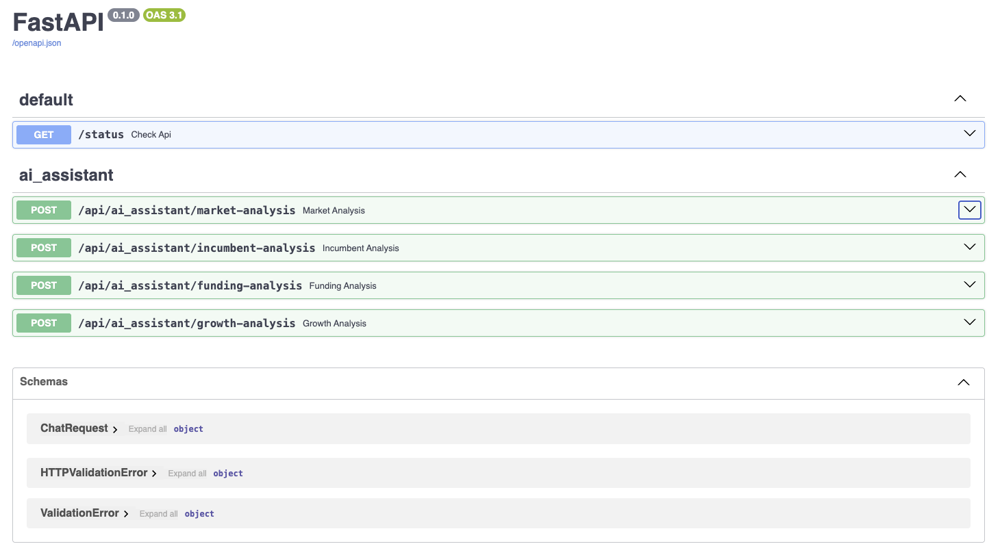

## Overview
- Used library: FastAPI + OpenAI + PydanticAI
- Simple abstract LLM service based on OpenAI SDK
- 5 Agents work together to achieve the end to end task
  - incumbents_analysis_agent: LLM + Tavily web search to get recent incumbents analysis
  - funding_analysis_agent: LLM + Tavily web search to get recent funding analysis
  - growth_analysis_agent: LLM + Tavily web search to get recent growth analysis
  - score_analysis_agent: LLM + predefined rules to generate score for each dimension (incumbents, funding, market growth)
  - overall_analysis_agent: Calculate overall score and generate final conclusion (judgement)
- Docker setup for whole backend service, easy to deploy and test
- Full logging for key outputs in each step, visualize backend reasoning process and easy to check internal output and troubleshooting

## High level design

## Local deployment
- clone the repository to local
- Create .env file and add openAI API key and Tavily API key (refer to env.example file)
- Under backend root folder, run `docker compose up` to run the backend in docker
- In browser type `localhost:3000/docs` to visit the all APIs, you can try any api endpoints with any product idea

    - `/api/ai_assistant/market-analysis` is for assigned task, others just for testing different agents

## Testing
I used following idea for testing: 
- Canada operator Telus enters finance market and provides own credit card service
<!-- - Costco provides credit card service to its members -->

Following is what I got: (Use `/api/ai_assistant/market-analysis`)

{
  "analysis": {
    
    "incumbents_analysis": "### Overview of Incumbents in Financial Services Relevant to Telus Credit Card\n\n1. **Telus Corporation**\n   - **Main Products/Features:** Telus operates as a major telecommunications provider in Canada and has expanded into various domains, including financial services. Through its subsidiary, Telus Digital, it provides outsourcing solutions tailored to financial service companies, enhancing customer support and trust in financial offerings. The company has focused on financial services, with a notable increase in revenue from this vertical.\n   - **Recent Business Summary:** In the first quarter of 2025, Telus reported a 16% revenue growth in its banking and financial services sector, primarily from collaborations with Canadian banks and financial institutions. Furthermore, Telus is keen on incorporating advanced digital solutions to bolster its financial services portfolio, aligning with its broader strategy of integrating various consumer services under its brand.\n\n2. **Royal Bank of Canada (RBC)**\n   - **Main Products/Features:** RBC offers a broad spectrum of financial services, including credit cards, personal banking, wealth management, and insurance. It has a robust digital banking platform that includes mobile banking features and cashback credit cards, alongside a highly-rated rewards program.\n   - **Recent Business Summary:** RBC has consistently reported strong financial performance, focusing on enhancing its digital services and improving customer experience. In 2025, RBC aimed to increase investment in technology enhancement to meet growing consumer demands for seamless banking experiences.\n\n3. **TD Bank**\n   - **Main Products/Features:** TD Bank is renowned for its extensive range of financial products, including numerous credit card options, personal and commercial banking, and wealth management services. The bank emphasizes customer-centric digital banking solutions and has established high rewards and cash-back credit card offerings.\n   - **Recent Business Summary:** TD Bank has been proactive in leveraging technology to improve customer service and operational efficiency. In recent reports, it highlighted significant growth in digital customer engagement, tapping into customer data to enhance personalized service offerings in 2024-2025.\n\n4. **BMO Financial Group**\n   - **Main Products/Features:** BMO provides a wide array of banking services including personal banking, commercial banking, and wealth management. It features an impressive catalog of credit cards designed for various consumer needs with strong rewards programs.\n   - **Recent Business Summary:** BMO has seen growth in its credit card segment, bolstered by ongoing digital transformation strategies and a focus on building partnerships for rewards programs. The bank is prioritizing customer loyalty through enriched service offerings and technological integration.\n\n5. **Scotiabank**\n   - **Main Products/Features:** Scotiabank offers credit cards, investment services, and personal banking. Their credit card products are noted for flexible rewards options and travel benefits, alongside advanced security features.\n   - **Recent Business Summary:** The bank reported solid growth in both card and personal loan segments in the first quarter of 2025, with a focus on expanding its digital product offerings to enhance customer journey and loyalty.\n\n### Conclusion\nThe landscape for financial services, particularly credit card offerings, is highly competitive, with established banks like RBC, TD, and BMO actively enhancing digital experiences and rewards programs. Telus's entry into this market with its credit card could leverage existing customer loyalty and emphasize unique features such as integration with telecom services and sustainability, setting it apart from incumbents.",
    
    "funding_analysis": "### Funding Landscape for Telus Credit Card & Related Financial Products\n\nThe consumer credit card market and broader fintech industry are currently experiencing notable investment activity, signaling a healthy interest from investors. This landscape is pertinent as Telus prepares to launch its credit card product. Here's a summary of the key funding trends relevant to Telus's initiative:\n\n1. **Strong Fintech Investment**:\n   - In the first quarter of 2025, global fintech startups raised **$10.3 billion**, marking the highest funding level since Q1 2023. This surge indicates strong investor confidence and revived appetite for fintech solutions, including payment, lending, and credit card technologies. (TechCrunch)\n\n2. **Top Players and Investment Rounds**:\n   - Many established fintech companies have received significant funding in 2025. For instance, **19 U.S. fintech startups secured over $50 million** each within the first quarter, showcasing substantial investor interest in innovative financial services. (TechCrunch)\n   - Noteworthy funding rounds include Juniper Square's **$130 million** Series D, underscoring ongoing investment in financial technology solutions relevant to data and transaction processing. (FinTech Futures)\n\n3. **Consumer Credit Market Trends**:\n   - Reports indicate that the **global credit card market is expected to reach $114.55 billion by 2029** with a moderate CAGR of **1.8%**. This growth is driven by trends such as contactless payments, security features, and enhanced personalization. Investing in a credit card product now positions Telus well within this expanding market. (The Business Research Company)\n\n4. **Competitive Landscape**:\n   - Major competitors like Chime and Brex have drawn significant funding, with Brex raising **$300 million** in Series D funding and Chime **$750 million** in Series I funding. Such companies serve as examples of how integrated financial solutions can successfully engage consumers. (Forbes)\n   - New market entrants focusing on sustainability, personalization, and integrated experiences mirror the strengths of the proposed Telus Credit Card, which promises eco-friendly materials and strong rewards programs for telecommunications and travel partners.\n\n5. **Recent Developments within Telus**:\n   - Telus's recent **$1.5 billion debt offering** and strategic partnerships, such as with TransUnion for enhanced consumer services, fortify its readiness to diversify into financial services. These moves are anticipated to enhance customer engagement, which is crucial for the credit card's success. (Yahoo Finance)\n\n### Conclusion\n\nThe funding landscape is favorable for Telus as it introduces its Credit Card. The overall growth in fintech investment indicates an advantageous climate for launching new financial products. Moreover, trends towards integrated financial solutions aligned with consumer needs present a compelling case for Telus's venture, backed by its established brand and customer base. The strategic insights gleaned from recent market activities highlight the potential for Telus to successfully establish a foothold in the competitive consumer credit landscape.",
    
    "growth_analysis": "### Market Growth Summary for the Credit Card Sector\n\nThe credit card market is experiencing notable growth, driven by various consumer trends and technological advancements. Here are key insights and projections regarding market dynamics:\n\n1. **Market Size and Growth Rate**:\n   - The global credit card market was valued at approximately **USD 530.2 billion in 2023**, with projections indicating substantial growth to **USD 1042.34 billion by 2032**, representing a **CAGR of 7.8%** during the forecast period from 2025 to 2032 (SkyQuest).\n   - Market Research Future (MRFR) estimates the market to increase from **USD 1,839.58 billion in 2025 to USD 2,500 billion by 2035**, reflecting a **CAGR of 2.83%** during this timeframe. This growth is attributed to rising consumer spending and an increasing shift towards online and digital payment methods.\n\n2. **Consumer Behavior Trends**:\n   - There has been a rising preference for **rewards-based credit cards**, which were valued at **USD 615.13 billion in 2024**, with future expectations of growth to **USD 850.0 billion by 2035**. This trend underscores a market emphasis on cashback and loyalty rewards systems, driving consumer engagement and satisfaction (MRFR).\n   - The shift towards **contactless payments** and secure digital transactions is becoming more prominent as consumers seek convenience and safety, further boosting credit card usage (The Business Research Company).\n\n3. **Technological Advancements**:\n   - The integration of traditional credit cards with digital wallets and mobile payment apps is a significant trend influencing growth. Companies are innovating in **mobile wallet integration**, enhancing user experience and security features, which are vital in maintaining competitive advantages in the fast-evolving payments landscape.\n\n4. **Future Projections**:\n   - According to insights from The Business Research Company, the credit card market revenue is anticipated to reach **USD 114.55 billion by 2029**, with a **CAGR of 1.8%** from 2025 to 2034. Despite a slowdown in growth rates post-2023, the market remains robust due to increasing consumer credit demand (The Business Research Company).\n\n5. **Technological Adaptations and Consumer Preferences**:\n   - The advent of **AI-powered fraud detection** and personalized customer experiences via digital platforms are critical in shaping up the future of credit card offerings. As noted, the market must adapt to consumers' preferences for seamless, timely, and secure payment methods to drive further adoption.\n\n6. **Competitive Landscape**:\n   - Major players like Visa and Mastercard are witnessing positive growth in transaction volumes, reflecting the steady increase in credit card usage globally. This competitive landscape necessitates differentiation for new entrants like Telus, which can leverage unique value propositions, such as **integrated digital services** and customer loyalty programs.\n\n### Conclusion\nThe credit card market presents a promising opportunity for Telus, especially with the increasing integration of technology in financial services. By aligning its offerings with market trends such as reward systems and digital integration, Telus can effectively tap into a growing consumer base eager for innovative and secure financial solutions.",

    "scores": {
      "incumbents": 0.6,
      "funding": 0.9,
      "growth": 0.8,
      "overall": 0.75
    },

    "final_judgement": "Move forward with Telus's credit card initiative. The overall score indicates a robust opportunity, as the favorable funding landscape and strong market growth trends align perfectly with consumer demand for integrated financial solutions. Telus can leverage its established brand loyalty and innovative features, such as sustainability and rewards programs, to differentiate itself against incumbents in a competitive market."
  }
}

- Ford electric car uses Google auto pilot software to be more competitive in the market

{
  "analysis": {
    "incumbents_analysis": "Here's a summary of key players relevant to Ford's proposal for an electric vehicle integrated with Google AutoPilot software:\n\n### 1. **Ford Motor Company**\n   - **Main Products/Features**: \n     - Ford BlueCruise (hands-free driving system) and recent EVs like the Mustang Mach-E and F-150 Lightning.\n     - Upcoming integration of EV-specific navigation tools into Google Maps without subscription fees, contrasted with competitors like GM, which charges for similar functionalities.\n   - **Recent Business Summary**: Ford is focusing on EV development and enhancing user experience through smart navigation and autonomous driving technologies. The company aims to promote ease of use in EVs, recently introducing new navigation features for their electric models, and emphasizes the effectiveness of their BlueCruise system, which has been rated highly compared to Tesla's offerings.\n\n### 2. **Tesla**\n   - **Main Products/Features**: \n     - Tesla's AutoPilot and Full Self-Driving (FSD) systems, which provide advanced autonomous driving capabilities.\n   - **Recent Business Summary**: Tesla remains a leader in the EV space, consistently innovating in autonomous driving technologies. CEO Elon Musk has been exploring potential licensing of their software, which reflects the competitive landscape of self-driving technology.\n\n### 3. **General Motors (GM)**\n   - **Main Products/Features**: \n     - Offers electric models like the Chevrolet Bolt and has implemented an Android-Based platform called Google Built-In, requiring subscription fees for navigation and integrated services.\n   - **Recent Business Summary**: GM has shifted towards a subscription-based model for many features, which has drawn criticism against Ford's subscription-free navigation offerings, indicating a growing rivalry in the EV market.\n\n### 4. **Google**\n   - **Main Products/Features**: \n     - Google AutoPilot technology, Google Maps for real-time traffic updates, and data analytics for vehicle navigation.\n   - **Recent Business Summary**: Google's collaboration with automotive companies focuses on enhancing in-car experiences and navigation solutions. Their technology is becoming integral in the EV landscape, supporting both Ford and other OEMs looking to incorporate smart mobility solutions.\n\n### 5. **Waymo**\n   - **Main Products/Features**: \n     - Level 4 autonomous driving technology and advancements in self-driving taxis.\n   - **Recent Business Summary**: As a subsidiary of Alphabet Inc. (Google’s parent company), Waymo continues to develop cutting-edge self-driving technology. Their system is gaining recognition, with discussions regarding broader applications in partnerships with vehicles from other automakers.\n\n### Conclusion\nFord's integration of Google AutoPilot and its emphasis on user-friendly navigation aligns well within a competitive EV market dominated by established players like Tesla and GM. Ford’s current strategies focus on enhancing autonomous driving capabilities while leveraging partnerships with tech giants like Google to stay ahead in smart mobility solutions.",
    
    "funding_analysis": "### Funding Landscape for Electric Vehicles and Autonomy Technology\n\nIn recent months, the electric vehicle (EV) and autonomous technology sectors have seen significant funding and collaborations, highlighting a robust landscape for potential products like Ford's proposal for an electric vehicle integrated with Google AutoPilot software.\n\n#### Notable Funding Initiatives\n\n1. **Department of Energy Loan to Ford**:\n   - Ford secured a monumental **$9.63 billion loan** from the U.S. Department of Energy (DOE) aimed at the BlueOval SK joint venture with SK On. This funding will establish **three battery manufacturing plants** in the U.S. dedicated to supplying batteries for Ford and Lincoln electric vehicles. This loan marks the largest awarded under the DOE's Advanced Technology Vehicles Manufacturing program, underscoring federal support for domestic EV production.\n   - **Sources**: [Utility Dive](https://www.utilitydive.com/news/blueoval-sk-closes-doe-loan-9billion-ev-battery-joint-venture/735777/), [CleanTechnica](https://cleantechnica.com/2024/12/16/ford-gets-9-63-billion-loan-for-blueoval-sk-from-us-doe).\n\n2. **Infrastructure Funding Support**:\n   - The **White House launched a $1 billion fund** named “Drive Forward,” aimed at assisting companies transitioning from internal combustion to electric vehicles. The fund is also geared towards investments in smart factories and autonomous driving systems, which could offer opportunities for Ford’s collaboration with Google.\n   - **Source**: [Utility Dive](https://www.utilitydive.com/news/monroe-capital-biden-harris-one-billion-fund-ev-manufacturing/728184/).\n\n3. **Global Investment Trends**:\n   - The EV market is accelerating with an infusion of funds globally, with **fintech and automotive investments surging to over $10.3 billion** in Q1 2025 alone. Companies like Rivian and Canoo are actively seeking funding to enhance their autonomous vehicle technology.\n   - **Source**: [TechCrunch](https://techcrunch.com/2025/03/06/vws-cheapest-ev-will-have-rivian-dna-and-who-is-bidding-for-canoos-assets/).\n\n4. **Emerging Startups and Technology**:\n   - Startups such as AiDEN Auto, specializing in connected vehicle technology, have also raised substantial funds, indicating strong market interest in integrated automotive technology solutions. AiDEN has attracted **$4.2 million** in seed funding, exemplifying investor appetite for innovative automotive technologies.\n   - **Source**: [TechCrunch](https://techcrunch.com/2025/03/06/vws-cheapest-ev-will-have-rivian-dna-and-who-is-bidding-for-canoos-assets/).\n\n### Summary\n\nThe current funding environment for electric vehicles is highly supportive, with substantial federal investments and a growing interest from both private sectors and financial investors in innovative automotive technologies. Ford's proposal to leverage Google AutoPilot within their electrification strategy is well-timed amid these funding trends. Partnerships, like the one with Google, could further amplify Ford's capabilities in autonomous driving, enhancing their competitive edge in the evolving EV market. This integration of advanced software and significant battery production capabilities positions Ford favorably for future growth in smart mobility solutions.",

    "growth_analysis": "### Market Growth Summary for Ford Electric Vehicle with Integrated Google AutoPilot Software\n\n**Electric Vehicle (EV) Market Growth:**\nThe global electric vehicle market is witnessing remarkable growth driven by various factors, including technological advancements, decreasing battery costs, and evolving consumer preferences. Key highlights from recent data include:\n\n1. **Sales Increase:** In 2024, global sales for fully electric and plug-in hybrid vehicles surged to over 17 million cars, reflecting a year-on-year increase of 25.6%. This growth is primarily attributed to high demand in China and stable sales in European markets.\n   \n2. **Future Projections:** According to BloombergNEF, it is expected that electric cars will account for 56% of global passenger vehicle sales by 2035 and reach 70% by 2040. The sales of battery-electric and plug-in hybrid vehicles are projected to hit nearly 22 million by 2025, marking a significant increase from previous years.\n\n3. **Regional Contributions:** China is anticipated to dominate EV sales, contributing nearly two-thirds of the total, followed by Europe and the U.S., which account for 17% and 7% respectively. Incentives and regulatory measures continue to promote adoption in these regions.\n\n4. **Market Share Growth:** EVs accounted for 10% of all vehicle sales in the U.S. in 2025, and this figure is forecasted to rise alongside the introduction of new models and continuous infrastructure improvements.\n\n**Autonomous Driving Technology Market Growth:**\nThe autonomous driving market is also on a steep growth trajectory, driven by innovations in AI and increased consumer interest for safer transport solutions.\n\n1. **Market Size and Projected Growth:** The global autonomous driving software market is projected to experience substantial growth, from approximately $2.02 billion in 2024 to around $7.24 billion by 2034, with a CAGR of 13.61%. The U.S. market alone is expected to grow at a CAGR of 13.82%, reaching $2.16 billion.\n\n2. **Overall Expansion in Autonomous Vehicles:** The autonomous vehicle market, valued at $170.22 billion in 2024, is expected to escalate to approximately $668.64 billion by 2033, growing at a CAGR of 17.63%. This growth is underpinned by advancements in technology, regulatory support, and rising consumer acceptance.\n\n3. **Key Drivers:** Factors such as improved AI technologies, development of partnership networks within the industry, and a growing emphasis on reducing emissions augment the prospects for the autonomous vehicle segment.\n\n4. **Adoption Trends:** The increasing focus on incorporating autonomous technologies in electric vehicles enhances market dynamics. The integration of features like Google’s AutoPilot with EV models positions companies like Ford advantageously in capturing tech-savvy consumers.\n\n### Conclusion\nWith the electric vehicle market poised for significant expansion and the autonomous driving software sector showing robust growth, Ford's proposal for an EV integrated with Google AutoPilot aligns well with market trends. This innovation has the potential to attract consumers looking for advanced technological features while positioning Ford as a competitive player in a rapidly evolving landscape.",

    "scores": {
      "incumbents": 0.5,
      "funding": 0.85,
      "growth": 0.9,
      "overall": 0.72
    },

    "final_judgement": "Move forward with the idea of integrating Google AutoPilot into Ford's electric vehicle lineup. The supportive funding landscape, rapid market growth for EVs and autonomous technologies, and Ford's innovative strategy place it ahead of competitors like GM and Tesla. This move could attract tech-savvy consumers and enhance Ford's market position."
  }
}
